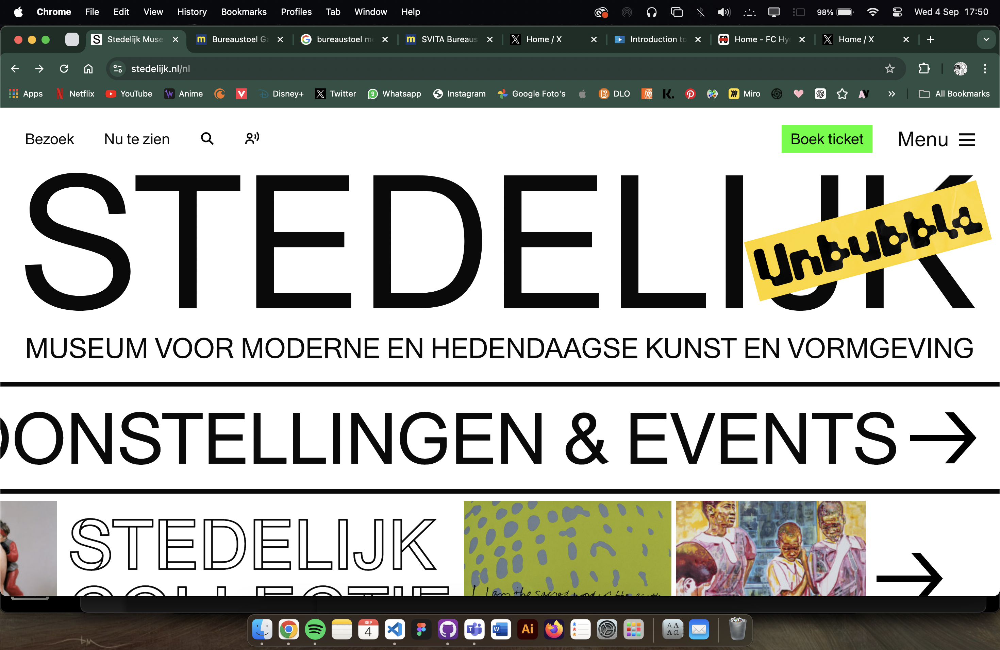
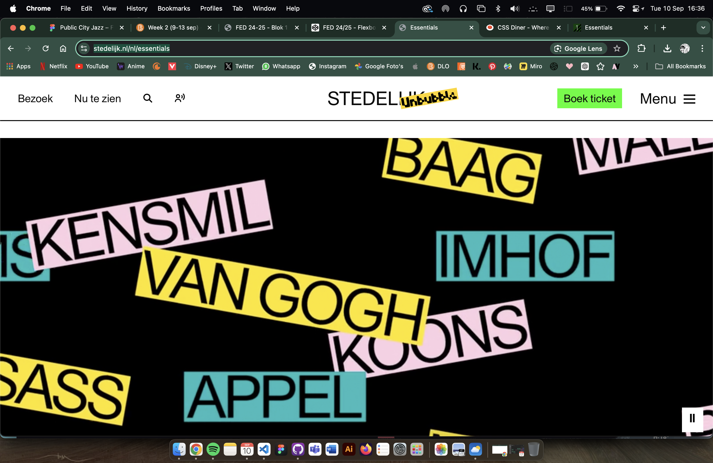
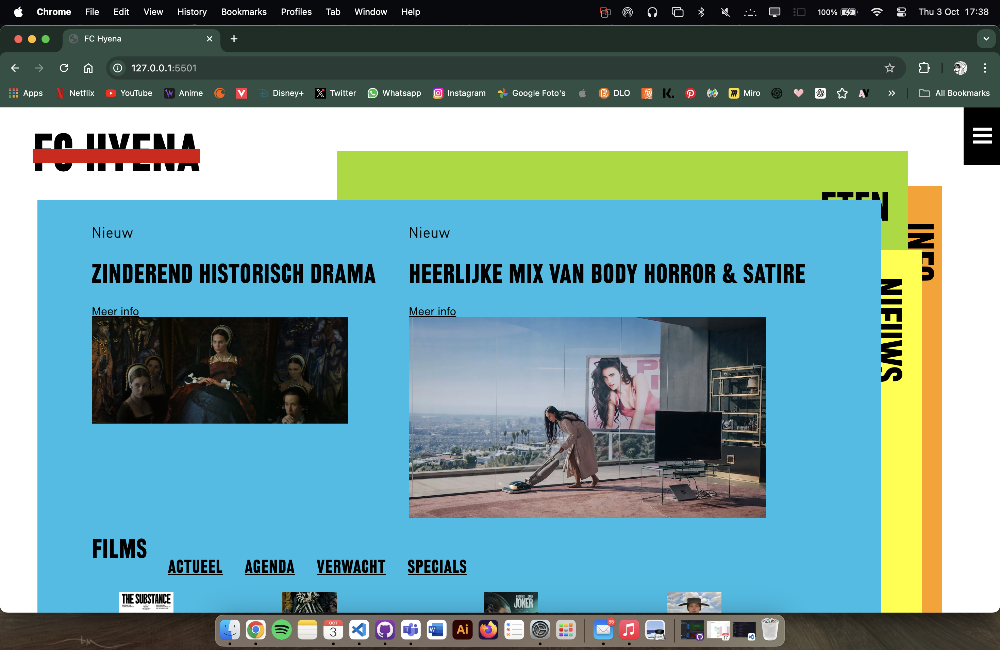
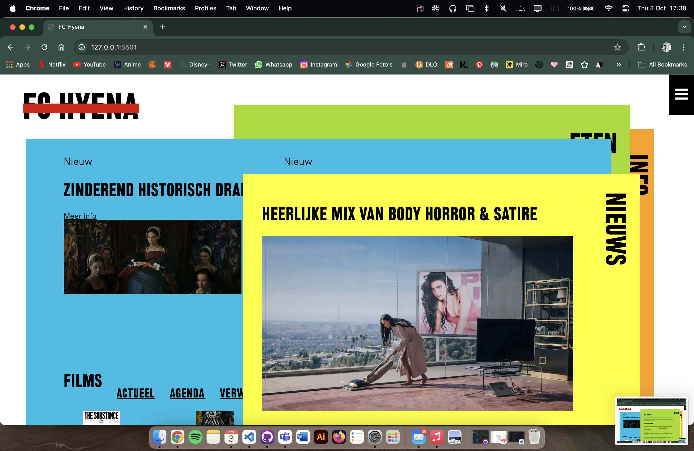
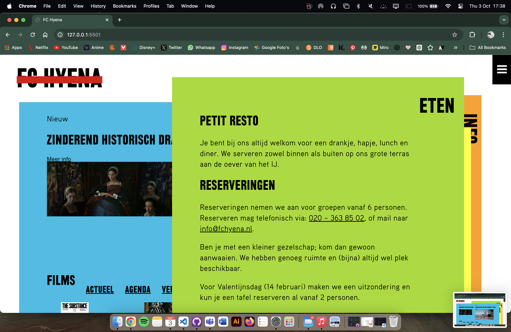
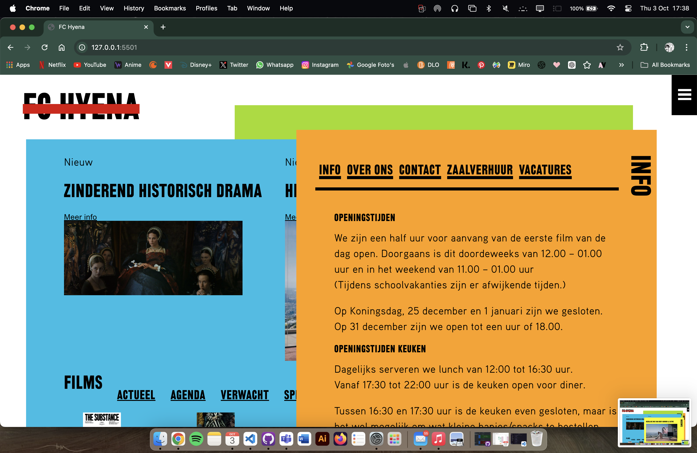

# Procesverslag
Markdown is een simpele manier om HTML te schrijven.  
Markdown cheat cheet: [Hulp bij het schrijven van Markdown](https://github.com/adam-p/markdown-here/wiki/Markdown-Cheatsheet).

Nb. De standaardstructuur en de spartaanse opmaak van de README.md zijn helemaal prima. Het gaat om de inhoud van je procesverslag. Besteedt de tijd voor pracht en praal aan je website.

Nb. Door *open* toe te voegen aan een *details* element kun je deze standaard open zetten. Fijn om dat steeds voor de relevante stuk(ken) te doen.

## Jij

  
uitwerken voor kick-off werkgroep

  ### Auteur:
  Choice Johnson

  #### Je startniveau:
  Rood

  #### Je focus:
  Responsive
 

## Je website

  
uitwerken voor kick-off werkgroep

  ### Je opdracht:
  link naar de website die je gaat namaken óf de naam/omschrijving van je eigen ontwerp
  https://www.stedelijk.nl/nl

  #### Screenshot(s) van de eerste pagina (small screen): 
  homepagina stedelijk museum  
  

  #### Screenshot(s) van de tweede pagina (small screen):
  Ana Lupas pagina stedelijk museum
  
 

## Toegankelijkheidstest 1/2 (week 1)

  
uitwerken na test in 2e werkgroep

  ### Bevindingen
  Lijst met je bevindingen die in de test naar voren kwamen:
  De website heeft al een goede toeganghelijkheid. Bij de WCAG checklist scoorde die veel ja's. 

  Het viel me op dat ze ipv sections om de h2's, headers hebben gebruikt. Dus voor elk deel van de pagina waar een h2 wordt gebruikt zit een header tag om. 
  Bij de alt text van de images zit geen nuttige informatie over de foto.
  Text kan tot 200% groot worden maar verdwijnt deels uit het scherm.

## Breakdownschets (week 1) ***

  
uitwerken na afloop 3e werkgroep

  ### de hele pagina: 
  

  ### dynamisch deel (bijv menu): 
  

  ### wellicht nog een dynamisch deel (bijv filter): 
  

## Voortgang 1 (week 2)

  
uitwerken voor 1e voortgang

  ### Stand van zaken
  Het schrijven van de HTML ging gemakkelijk. Ik kon goed zien hoe de website in elkaar zit.

  ### Agenda voor meeting
  samen met je groepje opstellen

  | choice         | fatima             | student 3    | student 4        |
  | ---            | ---                | ---          | ---              |
  | Vraag over     | vraag over         |              |                  |
  | scroll home    | pulsing button op  |              |                  |
  | page           | homepage           | ...          | ...              |

  ### Verslag van meeting
  hier na afloop snel de uitkomsten van de meeting vastleggen

 - Goed kijken naar dingen die een links of buttons zijn
 - Elementen nesten
 - aria-label gebruiken
 - 

## Voortgang 2 (week 3)

  
uitwerken voor 2e voortgang

  ### Stand van zaken
  hier dit ging goed & dit was lastig (neem ook screenshots op van delen van je website en code)

  Het maken van het hamburger menu maken ging wat moeilijk omdat ik meerdere elementen probeerde op te roepen met 1 class, maar met wat hulp is het gelukt. Verder ben ik nog bezig met de styling

  
  

  ### Agenda voor meeting
  samen met je groepje opstellen

  | Choice         | student 2       | student 3    | student 4        |
  | ---            | ---             | ---          | ---              |
  | nav in hambu-  |                 |              |                  |
  | ger menu.      |                 |              |                  | 
  | ...            | ...             | ...          | ...              |

  ### Verslag van meeting
  hier na afloop snel de uitkomsten van de meeting vastleggen

  - goed gebruik maken van de inspect in de browser om te kijken of er ergens bijv. verkeerde margin of padding is
  - gebruik maken van pseudo selectoren
  - goed gebruik maken van de inspector om fouten te vinden

## Toegankelijkheidstest 2/2 (week 4)

  
uitwerken na test in 9e werkgroep

  ### Bevindingen
  Lijst met je bevindingen die in de test naar voren kwamen (geef ook aan wat er verbeterd is):
  - vergeleken met de officele site van FC hyena, heb ik duidelijk focus states (zij hebben er geen).
  - als selector voor de tekst gebruiken ze dezelfde gele kleur als de nieuws pagina, deze heb ik veranderd zodat je op die pagina wel de selector kleur ziet.

## Voortgang 3 (week 4)

  
uitwerken voor 3e voortgang

  ### Stand van zaken
  Begin vorige week was ik opnieuw begonnen aan een nieuwe website. Het opzetten en stijlen van de website ging deels makkelijk en goed, alleen zit ik nu te kijken hoe ik heb goed toegankelijk kan maken met de screenreader. Omdat er section op elkaar zijn gestapelt moet ik goed kijken hoe de gebruiker er zo goed mogelijk doorheen kan navigeren.

  ### Agenda voor meeting
  samen met je groepje opstellen

  | Choice         | student 2          | student 3    | student 4        |
  | ---            | ---                | ---          | ---              |
  | sections over  | scalen met grid    | image mee    |grid en foto op   |
  | elkaar laten   |                    | laten        | zelfde maat      |
  | scrollen       | ...                | bewegen      | krijgen          |

  ### Verslag van meeting
  hier na afloop snel de uitkomsten van de meeting vastleggen

  - light-dark gebruiken
  - scroll based animations
  - image fit content

## Eindgesprek (week 5)

  
uitwerken voor eindgesprek

  ### Je uitkomst - karakteristiek screenshots:
  
  
  
  

  ### Dit ging goed/Heb ik geleerd: 
  Korte omschrijving met plaatjes

  Ik heb veel geleerd over hoe ik de website zo toeganglijk mogelijk kan maken. Ook heb ik veel ondekt over het stijlen van elementen en wat javascript dingen zoals classList. 

  Op de info pagina heb ik geleerd hoe ik dmv flex en ids content op het scherm kan 'verstoppen' en kan laten veranderen zonder javascript.
  

  ### Dit was lastig/Is niet gelukt:
  Korte omschrijving met plaatjes
  - Header en nav op de goede z-index krijgen
  - Links in de header nav de sections laten openen
  - Apart hover kleuren in de header nav
  - Film pagina
  - De naam van de link naar de content op de info pagina wit laten wanneer je er op het gedrukt (en de andere moeten dan weer terug)
  - Met tabben de sections laten openen (als je nu door de links tabt, tabt ie wel door de section maar blijft het stacked)
  - laatste media query voor kleine scherm

  

## Bronnenlijst

  
continu bijhouden terwijl je werkt

  Nb. Wees specifiek ('css-tricks' als bron is bijv. niet specifiek genoeg). 
  Nb. ChatGpT en andere AI horen er ook bij.
  Nb. Vermeld de bronnen ook in je code.

  1. Chatgpt prompt: "can you make it so that the button acts as a toggle" + zelfgeschreven code ( // let vidImage = document.querySelector("section section div div img");
// let fcVideo = document.querySelector("section section div div video");
// let vidButton = document.querySelector("section section div div button");

// // Add click event to the button
// vidButton.addEventListener('click', function() {
//     // Hide the image
//     vidImage.style.display = 'none';
    
//     // Show the video
//     fcVideo.style.display = 'block';
    
//     // Play the video
//     fcVideo.play();
// });), zelf classLists toegevoegd

  2. https://fchyena.nl/ voor de calc berekening van de width en in de media queries
  

